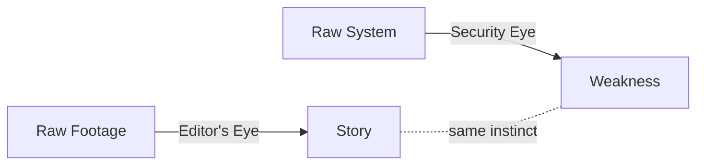

# 🎬 Dinesh Kumar M
### *Video Editor by Craft · Cyber Security by Curiosity*

<p align="center">
  
  
  
</p>

---

> *"Every frame tells a story. Every packet tells a secret. I work in both languages."*

Two crafts, one mindset: **look closely, find what others miss, and shape it into something that matters.**
In editing, that means finding the exact frame where a story clicks. In security, it means finding the exact line where a system breaks. Same eye. Different canvas.

---

## 🎞️ `/video-editing`

```
> status: rendering...
> pipeline: raw_footage → cut → grade → sound_design → export
> output: cinematic_content.mp4 ✔
```

**Specialties**
| Category | Services |
|---|---|
| 🎓 **College & Campus** | Event Editing · Promotional Videos · Fest Highlights · Cultural Event Films |
| 📱 **Creator & Social** | Instagram Reels · YouTube Shorts · Social Media Post Design |
| 🏢 **Business & Brand** | Corporate Videos · Promotional Edits · Logo Reveal Animation · Intro/Outro Motion |
| 💍 **Personal Milestones** | Wedding Films |
| 🔊 **Audio Craft** | Sound Design · Audio Enhancement & Mixing |

**Toolkit:** Premiere Pro · After Effects · DaVinci Resolve · Color Grading · Motion Graphics

---

## 🔐 `/cyber-security`

```
> scanning system...
> vulnerabilities found: curiosity, persistence
> access: granted
```

A parallel track — understanding how systems are built so I can understand how they break. Where video editing is about controlling *what people see*, security is about controlling *what people can't get into*. Both require patience, attention to detail, and a refusal to accept things at face value.

**Areas of interest:** Network Fundamentals · Vulnerability Awareness · Ethical Hacking Basics · Security-Minded Problem Solving

---

## 🧠 Why Both?



Editing taught me to see structure inside chaos. Security taught me to question that structure. Together, they make me someone who doesn't just execute a task — I look for the story *and* the risk hiding inside it.

---

## 📂 Featured Work

- 🎬 College Fest Highlights — Panimalar Engineering College
- 📢 Campus Promotional Videos
- 💒 Wedding Highlight Films
- ✨ Logo Reveal Animations
- 📱 Freelance Reels & Social Content

*(Full showcase live on the portfolio site — video previews embedded via Google Drive.)*

---

## 🎓 Background

| Timeline | Milestone |
|---|---|
| 2023 – 2026 | B.Sc. Computer Science — Panimalar Engineering College |
| 2019 – 2022 | Mechanical Engineering — Panimalar Polytechnic College |
| 2023 – Present | Freelance Video Editor |

---

## 💬 Testimonial

> *"An exceptional video editor with a keen eye for detail and storytelling. Every frame is crafted with purpose."*
> — **Alex Carter**, Creative Director, Vision Studios

---

## 📬 Let's Connect

📧 **mohandhinesh2001@gmail.com**
📱 **+91 91507 34657**
📍 Chennai, India

---

<p align="center">
<i>Cutting stories. Questioning systems. Always editing something.</i>
</p>
